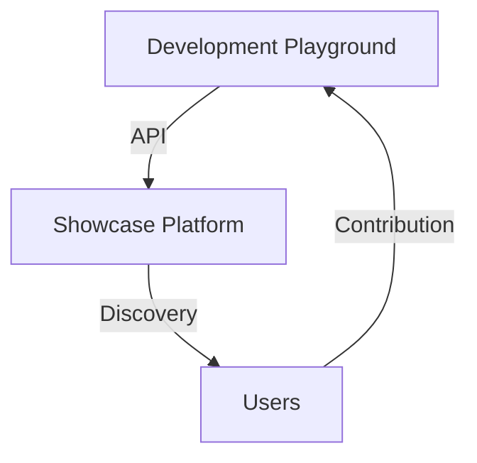

# Agentopia

Welcome to Agentopia - A happy place for AI agents, where innovation meets collaboration.

<!-- Test comment for pre-commit hook verification -->

## Overview

Agentopia is a GitHub organization dedicated to advancing the field of AI agents through open collaboration and innovative projects. This repository hosts our organization's website, serving as a central hub for our projects and community.

### Platform Architecture

AI Agentopia consists of two main components:

1. **Showcase Platform** (this repository)

   - Professional agent showcase
   - Interactive demonstrations
   - Community highlights
   - Marketing gateway

2. **Development Playground** ([agentopia-playground](https://github.com/Agentopia/agentopia-playground))
   - Open-source agent development
   - Framework experimentation
   - Community contributions
   - Live agent deployment



## Features

- **Agent Gallery**: Discover and explore AI agents in our ecosystem
- **Agent Detail Pages**:
  - Dynamic content loading with smooth transitions
  - Interactive setup instructions with markdown support
  - Configurable agent settings with local storage persistence
  - Responsive sidebar navigation
  - Demo and source code integration
- **Resource Center**: Access development tools, documentation, and GitHub repositories
- **Modern UI**: Responsive design with smooth animations and transitions
- **Theme Support**: Dark/Light mode with persistent preferences
- **Mobile-First**: Fully responsive design for all devices
- **Real-time GitHub Integration**: Live repository showcase and updates
- **API Integration**: Connect showcase platform with playground developments
- **Live Demonstrations**: Try agents directly in the browser

## Pages

- **Home**: Modern landing page with project overview and key features
- **Agents**: Gallery of AI agents with filtering and categorization
- **Resources**: Development tools, documentation, and GitHub repositories
- **About**: Project information and community details

## Getting Started

### Prerequisites

- Modern web browser with JavaScript enabled
- Git (for development)

### Local Development

1. Clone the repository:

```bash
git clone https://github.com/Agentopia/agentopia.github.io.git
cd agentopia.github.io
```

2. Open `index.html` in your browser to view the site locally.

3. Make changes and test locally before committing.

## Project Structure

```
agentopia.github.io/
├── css/
│   └── styles.css      # Main stylesheet
├── js/
│   ├── navigation.js   # Navigation functionality
│   ├── theme.js        # Theme toggle functionality
│   └── agent-detail.js # Agent detail page functionality
├── images/
│   └── logo.svg        # Project logo
├── docs/
│   ├── AGENT-DEVELOPMENT.md  # Development guidelines
│   └── CATEGORY-STANDARDS.md # Agent standards
├── tools/
│   └── api-reference.html    # API documentation
├── index.html          # Homepage
├── agents.html         # Agents gallery page
├── resources.html      # Resources and documentation
└── about.html          # About page
```

## Contributing

We welcome contributions! Please see our [Contributing Guidelines](CONTRIBUTING.md) for details on:

- Code of Conduct
- Development process
- Pull request process
- Coding standards

## Branch Strategy

We follow a structured branching strategy:

- `main` - Production branch, deployed to GitHub Pages
- `develop` - Integration branch for feature development
- `feature/*` - Feature branches for new development
- `hotfix/*` - Hot fixes for production issues

## Development Resources

- [Agent Development Guide](docs/AGENT-DEVELOPMENT.md)
- [Category Standards](docs/CATEGORY-STANDARDS.md)
- [API Documentation](tools/api-reference.html)
- [Best Practices](tools/best-practices.html)

## License

This project is licensed under the MIT License - see the [LICENSE](LICENSE) file for details.

## Contact

- GitHub Organization: [@Agentopia](https://github.com/Agentopia)
- Website: [agentopia.github.io](https://agentopia.github.io)
