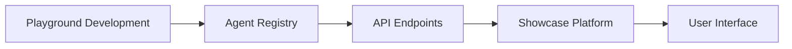
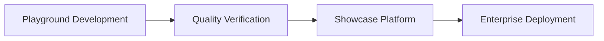

# AI Agents Platform Development Strategy

## Overview
Building a comprehensive AI Agents ecosystem consisting of two key components:
1. A curated showcase platform (agentopia.github.io)
2. An open-source development playground (agentopia-playground)

## Strategic Goals
1. Create a professional showcase for AI agents
2. Build an open community for agent development
3. Establish standards for agent creation and integration
4. Enable seamless flow from development to production

## Core Components Matrix
┌──────────────────────────────────────────────────────────────┐
│                Private Repo           Public Repo            │
├────────────┬─────────────────────┬────────────────────────┤
│ Platform   │ Showcase Platform   │ Development Playground  │
│            │ - Curated Agents    │ - Community Building    │
│            │ - Commercial Ready  │ - Open Innovation       │
├────────────┼─────────────────────┼────────────────────────┤
│ Agents     │ Production Agents   │ Development Agents      │
│            │ - Quality Verified  │ - Experimental         │
│            │ - Enterprise Ready  │ - Framework Testing    │
└────────────┴─────────────────────┴────────────────────────┘

## Major Components

### 1. Showcase Platform (agentopia.github.io)
#### Purpose
- Professional agent showcase
- Category-based organization
- Quality verification system
- Commercial deployment ready

#### Key Features
- Matrix categorization (Regular/Autonomous × Single/Multi)
- Agent performance metrics
- Enterprise integration capabilities
- Quality assurance system

### 2. Development Playground (agentopia-playground)
#### Purpose
- Open-source development environment
- Framework experimentation
- Community contribution
- Innovation hub

#### Key Features
- Multiple framework support (Langchain, AutoGen, CrewAI)
- Development templates
- Testing environments
- Contribution guidelines

## Development Timeline

### Phase 1: Showcase Platform (Jan 15 - Jan 27)
- Basic showcase infrastructure
- Core agent categories implementation
- UI and platform launch

### Phase 2: Playground Development (Feb - Mar 2025)
- Public repository setup
- Framework integration
- Community contribution guidelines
- Initial agent templates

### Phase 3: Integration & Growth (Q2 2025)
- Showcase-Playground integration
- Community engagement
- Agent marketplace development
- Advanced features rollout

## Implementation Strategy

### Showcase Platform Development
1. Core Infrastructure
   - Agent metadata system
   - Category framework
   - Quality verification pipeline

2. Agent Categories
   - Regular Single Agents
   - Regular Multi-Agents
   - Autonomous Single Agents
   - Autonomous Multi-Agents

3. Platform Features
   - Agent showcase pages
   - Performance metrics
   - Integration capabilities
   - Documentation system

### Playground Development
1. Framework Integration
   - Langchain support
   - AutoGen support
   - CrewAI support
   - Custom frameworks

2. Development Tools
   - Agent templates
   - Testing framework
   - Documentation tools
   - Community guidelines

3. Community Features
   - Contribution system
   - Review process
   - Version control
   - Communication channels

## Integration Architecture
### API Integration
- RESTful/GraphQL APIs for agent data
- Secure authentication between platforms
- Real-time agent status updates
- Performance metrics collection

### Deployment Strategy
#### Showcase Platform (Private)
- Vercel deployment
- Marketing and discovery interface
- Agent demonstration environment
- Community engagement analytics

#### Development Playground (Public)
- Independent deployment
- Agent runtime environment
- API endpoints for agent access
- Framework documentation hosting

### Data Flow

## Integration Flow

## Success Metrics
1. Platform Metrics
   - Number of showcased agents
   - Category coverage
   - User engagement
   - Enterprise adoption

2. Community Metrics
   - Active contributors
   - Framework adoption
   - Development activity
   - Community growth

## Quality Standards
1. Code Quality
   - Testing coverage
   - Documentation
   - Performance benchmarks
   - Security standards

2. Agent Quality
   - Functionality verification
   - Performance metrics
   - Security assessment
   - Integration readiness

## References
- Project Epic: #[Epic issue number]
- Project Board: AI Agentopia
- Documentation: [Category Standards](docs/category-standards.md)
