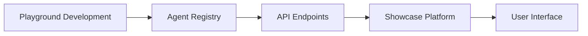
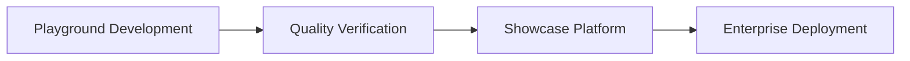

# AI Agents Platform Development Strategy

## Vision & Roadmap

### Vision

Agentopia aims to build a robust, flexible, and community-driven ecosystem for AI agent development. Our goal is to make it easy for anyone—developers and non-developers alike—to create, share, and deploy AI agents using a variety of frameworks and tools. We want Agentopia to be the go-to platform for discovering, experimenting with, and integrating AI agents, supporting both local and cloud-based workflows.

Key principles:
- **Framework Agnostic:** Support for multiple agent-building frameworks (e.g., LangChain, AutoGen, CrewAI, and no-code tools), with a standard interface for easy integration.
- **Scalable & Modular:** Agents can be run locally first, with a clear path to migrate or deploy them to the cloud as the ecosystem grows.
- **Open & Extensible:** Easy integration of open-source agents and frameworks, with clear contribution guidelines and a welcoming community.
- **User-Friendly:** Agents are organized and discoverable by category, with intuitive navigation from the portal to category and agent detail pages.
- **Data-Driven:** Agent metadata and configuration are managed via structured manifest files, enabling automation and future enhancements.

### Roadmap

#### **Phase 1: Local Agent Development & Showcase (Current)**
- Develop a static, responsive web portal for browsing and discovering agents.
- Build a local-first agent development playground, supporting multiple frameworks.
- Organize agents by category, with each agent described by a manifest (metadata, framework, instructions).
- Provide templates and testing environments for agent development.
- Establish clear contribution guidelines and community standards.

#### **Phase 2: Enhanced Frontend & Dynamic Integration**
- Add dynamic features to the portal (e.g., live GitHub repo fetching, documentation and agent search).
- Enable launching agents directly from the portal, with support for both local and remote/cloud execution.
- Improve user experience with interactive API examples and advanced documentation.
- Expand framework support and adapters for new agent-building tools.

#### **Phase 3: Cloud-Ready & Full-Stack Expansion**
- Develop backend services for cloud-based agent hosting and management.
- Integrate authentication, database, and API layers for scalable deployments.
- Enable users to deploy, manage, and share agents in the cloud through Agentopia.
- Continue to grow the open-source agent library and foster community innovation.

## Overview
Building a comprehensive AI Agents ecosystem consisting of two key components:
1. A curated showcase platform (agentopia.github.io)
2. An open-source development playground (agentopia-playground)

## Strategic Goals
1. Create a professional showcase for AI agents
2. Build an open community for agent development
3. Establish standards for agent creation and integration
4. Enable seamless flow from development to production

## Core Components Matrix
┌──────────────────────────────────────────────────────────────┐
│                Private Repo           Public Repo            │
├────────────┬─────────────────────┬────────────────────────┤
│ Platform   │ Showcase Platform   │ Development Playground  │
│            │ - Curated Agents    │ - Community Building    │
│            │ - Commercial Ready  │ - Open Innovation       │
├────────────┼─────────────────────┼────────────────────────┤
│ Agents     │ Production Agents   │ Development Agents      │
│            │ - Quality Verified  │ - Experimental         │
│            │ - Enterprise Ready  │ - Framework Testing    │
└────────────┴─────────────────────┴────────────────────────┘

## Major Components

### 1. Showcase Platform (agentopia.github.io)
#### Purpose
- Professional agent showcase
- Category-based organization
- Quality verification system
- Commercial deployment ready

#### Key Features
- Matrix categorization (Regular/Autonomous × Single/Multi)
- Agent performance metrics
- Enterprise integration capabilities
- Quality assurance system

### 2. Development Playground (agentopia-playground)
#### Purpose
- Open-source development environment
- Framework experimentation
- Community contribution
- Innovation hub

#### Key Features
- Multiple framework support (Langchain, AutoGen, CrewAI)
- Development templates
- Testing environments
- Contribution guidelines

## Development Timeline

### Phase 1: Showcase Platform (Jan 15 - Jan 27)
- Basic showcase infrastructure
- Core agent categories implementation
- UI and platform launch

### Phase 2: Playground Development (Feb - Mar 2025)
- Public repository setup
- Framework integration
- Community contribution guidelines
- Initial agent templates

### Phase 3: Integration & Growth (Q2 2025)
- Showcase-Playground integration
- Community engagement
- Agent marketplace development
- Advanced features rollout

## Implementation Strategy

### Showcase Platform Development
1. Core Infrastructure
   - Agent metadata system
   - Category framework
   - Quality verification pipeline

2. Agent Categories
   - Regular Single Agents
   - Regular Multi-Agents
   - Autonomous Single Agents
   - Autonomous Multi-Agents

3. Platform Features
   - Agent showcase pages
   - Performance metrics
   - Integration capabilities
   - Documentation system

### Playground Development
1. Framework Integration
   - Langchain support
   - AutoGen support
   - CrewAI support
   - Custom frameworks

2. Development Tools
   - Agent templates
   - Testing framework
   - Documentation tools
   - Community guidelines

3. Community Features
   - Contribution system
   - Review process
   - Version control
   - Communication channels

## Integration Architecture
### API Integration
- RESTful/GraphQL APIs for agent data
- Secure authentication between platforms
- Real-time agent status updates
- Performance metrics collection

### Deployment Strategy
#### Showcase Platform (Private)
- Vercel deployment
- Marketing and discovery interface
- Agent demonstration environment
- Community engagement analytics

#### Development Playground (Public)
- Independent deployment
- Agent runtime environment
- API endpoints for agent access
- Framework documentation hosting

### Data Flow

## Integration Flow

## Success Metrics
1. Platform Metrics
   - Number of showcased agents
   - Category coverage
   - User engagement
   - Enterprise adoption

2. Community Metrics
   - Active contributors
   - Framework adoption
   - Development activity
   - Community growth

## Quality Standards
1. Code Quality
   - Testing coverage
   - Documentation
   - Performance benchmarks
   - Security standards

2. Agent Quality
   - Functionality verification
   - Performance metrics
   - Security assessment
   - Integration readiness

## Milestone Update: Planning Docs v0.1.0 (2025-06-01)

- Completed first round of core planning documents for Agentopia agent ecosystem:
  - System Architecture
  - Agent Manifest Standard
  - Repository Structure
  - Integration Workflow
  - Open-Source Integration Guide
- Each doc now includes versioning (v0.1.0) and last updated date.
- This milestone establishes a clear, modular foundation for agent development, integration, and community contributions.

## References
- Project Epic: #[Epic issue number]
- Project Board: AI Agentopia
- Documentation: [Category Standards](docs/category-standards.md)
- [Planning & Architecture Docs](./agent-development-planning/)
    - [System Architecture](./agent-development-planning/architecture.md)
    - [Agent Manifest Standard](./agent-development-planning/agent-manifest.md)
    - [Repository Structure](./agent-development-planning/repo-structure.md)
    - [Integration Workflow](./agent-development-planning/integration-workflow.md)
    - [Open-Source Integration Guide](./agent-development-planning/open-source-integration.md)
    - [Vision & Roadmap](./agent-development-planning/vision-roadmap.md)
